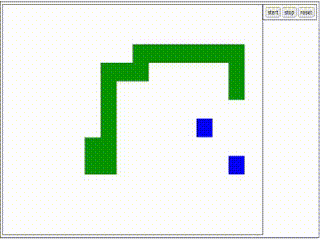

# goworm
single worm game (golang + html5/js)

# description

it's simple example at [snake game](https://en.wikipedia.org/wiki/Snake_(video_game_genre)) (but i call he worm).

i use golang(service) and HTML5+JavaScript(vanila)(client).

i can create all logic on JS, but it's not fun.
